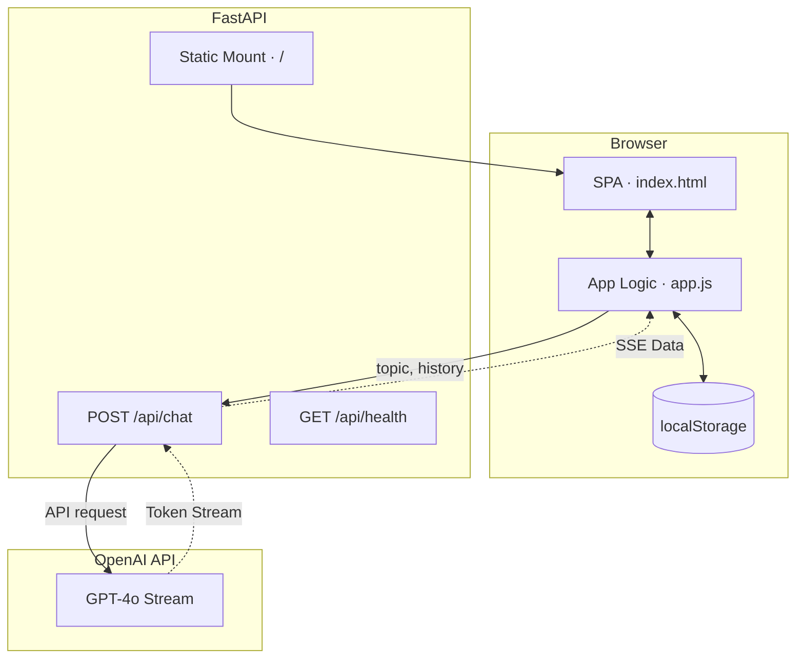

# AIProjecTy

<p align="center">
  <strong>Intelligent conversational AI interface</strong> — A production-grade web application providing a seamless, single-screen chat experience powered by OpenAI's language models, built with a FastAPI backend and a zero-dependency vanilla frontend.
</p>

<p align="center">
  <a href="https://github.com/ShahabAhmed01/aiprojecty/actions"></a>
  <a href="LICENSE"></a>
  <a href="https://www.python.org/downloads/"></a>
  <a href="https://fastapi.tiangolo.com/"></a>
  <a href="https://railway.app"></a>
</p>

<p align="center">
  <a href="#overview">Overview</a> ·
  <a href="#features">Features</a> ·
  <a href="#architecture">Architecture</a> ·
  <a href="#quick-start">Quick Start</a> ·
  <a href="#configuration">Configuration</a> ·
  <a href="#api">API</a> ·
  <a href="#deployment">Deployment</a> ·
  <a href="#contributing">Contributing</a>
</p>

---

## Overview

**AIProjecTy** is a lightweight, self-hostable AI chat application that delivers a ChatGPT-like experience with real-time streaming responses, conversation persistence, and a polished single-screen UI.

| Mode | API keys | Behavior |
|------|----------|----------|
| **Demo** | None required | Chat interface active, simulated responses or missing credential warnings |
| **Live** | `OPENAI_API_KEY` | Real-time LLM streaming via OpenAI |

The stack relies purely on **Python + FastAPI** for the backend and **vanilla HTML/CSS/JS** for the frontend, entirely eliminating heavy Node build steps.

<p align="center">
  <em>Repository:</em> <a href="https://github.com/ShahabAhmed01/aiprojecty">github.com/ShahabAhmed01/aiprojecty</a>
</p>

---

## Features

| Capability | Description |
|------------|-------------|
| **Real-time streaming** | Token-by-token response streaming via Server-Sent Events (SSE) with animated cursor |
| **Single-screen layout** | Everything fits one viewport; no page redirects, internal message scrolling |
| **Conversation history** | Sidebar with localStorage-backed history to resume past sessions |
| **Multi-model switching** | Dynamic toggle between GPT-4o, GPT-4o-mini, and GPT-3.5-turbo |
| **Markdown rendering** | Code blocks, bold/italic, headings, and lists rendered inline seamlessly |
| **Responsive design** | Adaptive layout and collapsible sidebar for mobile devices |
| **Zero-dependency UI** | Pure HTML/CSS/JS frontend; no React, no Webpack, zero build step |

---

## Architecture



Deep dive: [`docs/ARCHITECTURE.md`](docs/ARCHITECTURE.md)

---

## Quick Start

### Prerequisites

- Python **3.10+**
- An [OpenAI API key](https://platform.openai.com/api-keys)

### Install and run

```bash
git clone https://github.com/ShahabAhmed01/aiprojecty.git
cd aiprojecty

python -m venv venv
# Windows
venv\Scripts\activate
# macOS / Linux
# source venv/bin/activate

pip install -r requirements.txt
cp .env.example .env   # Add OPENAI_API_KEY

python run.py
```

Open **[http://localhost:8000](http://localhost:8000)** to start chatting.

---

## Configuration

| Variable | Required | Default | Description |
|----------|:--------:|---------|-------------|
| `OPENAI_API_KEY` | Yes | — | OpenAI API key for live LLM streaming |
| `DEFAULT_MODEL` | No | `gpt-4o` | Default model selection |
| `HOST` | No | `0.0.0.0` | Bind address |
| `PORT` | No | `8000` | HTTP port |
| `MAX_TOKENS` | No | `2048` | Maximum tokens per response |

Copy [`.env.example`](.env.example) to `.env` and configure your API keys.

---

## API

Base URL: `http://localhost:8000/api`

| Method | Endpoint | Description |
|--------|----------|-------------|
| `GET` | `/health` | Service health status |
| `POST` | `/chat` | Start streaming chat response |

**Example — chat endpoint**

```bash
curl -X POST http://localhost:8000/api/chat \
  -H "Content-Type: application/json" \
  -d '{"messages": [{"role": "user", "content": "Explain quantum entanglement simply."}], "model": "gpt-4o", "stream": true}'
```

---

## Deployment

Production deployment guides:

| Platform | Config |
|----------|--------|
| **Railway** | [`railway.toml`](railway.toml) |
| **Render** | [`render.yaml`](render.yaml) |
| **Docker** | `docker build -t aiprojecty . && docker run -p 8000:8000 -e OPENAI_API_KEY=sk-... aiprojecty` |

Full instructions: **[`docs/DEPLOYMENT.md`](docs/DEPLOYMENT.md)**

---

## Project structure

```text
aiprojecty/
├── backend/           # FastAPI app, config, and middleware
│   ├── routes/        # API route handlers (chat, health)
│   └── services/      # OpenAI client, streaming logic
├── frontend/          # SPA (HTML, CSS, JS)
├── docs/              # Architecture and deployment guides
├── Dockerfile
├── render.yaml
├── requirements.txt
└── run.py
```

---

## Tech stack

| Layer | Technology |
|-------|------------|
| API | FastAPI, Uvicorn, Pydantic v2 |
| LLM | OpenAI Python SDK |
| Frontend | Vanilla HTML, CSS, JavaScript |

---

## Contributing

Contributions are welcome. Please read [`CONTRIBUTING.md`](CONTRIBUTING.md) and [`CODE_OF_CONDUCT.md`](CODE_OF_CONDUCT.md) before opening a pull request.

1. Fork the repository
2. Create a feature branch (`git checkout -b feature/your-change`)
3. Commit with a clear message
4. Open a pull request against `main`

---

## License

This project is licensed under the **MIT License** — see [`LICENSE`](LICENSE).

```text
Copyright (c) 2026 Shahab Ahmed
```
