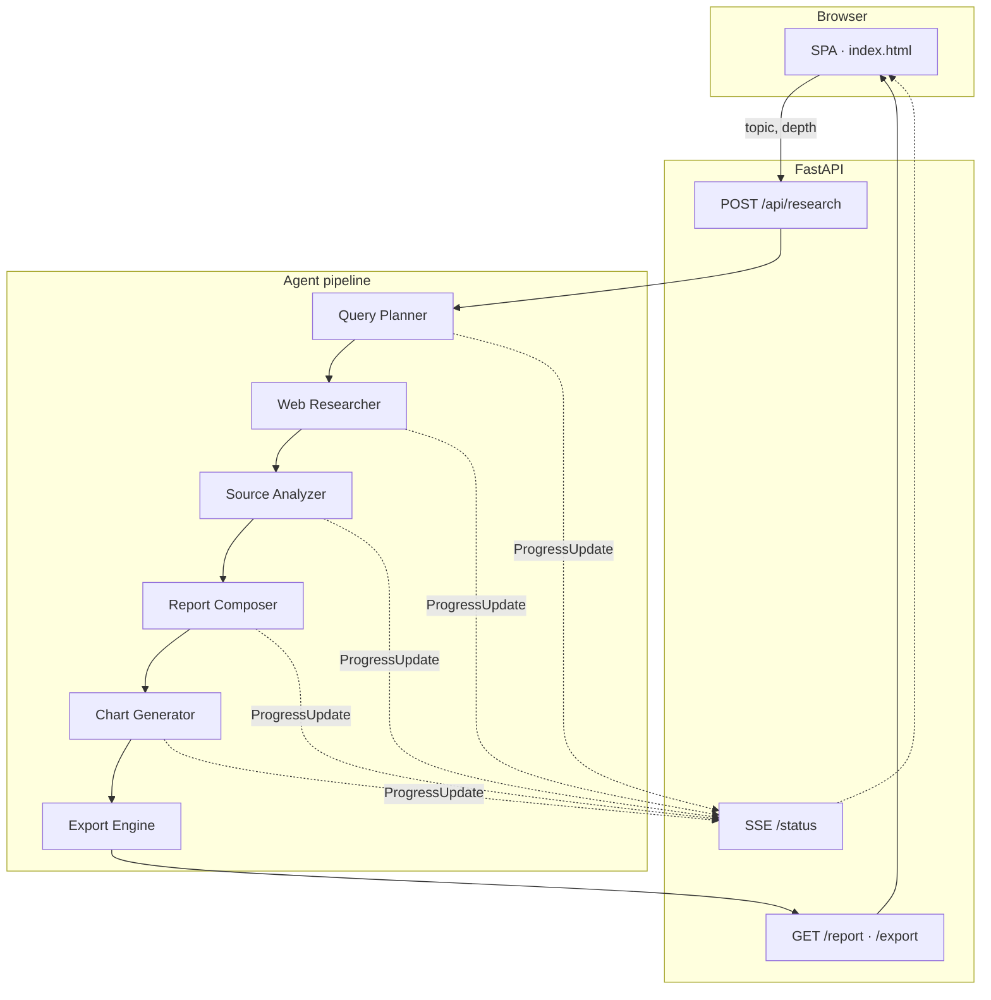

<p align="center">
  
</p>

<h1 align="center">Zynex</h1>

<p align="center">
  <strong>Autonomous AI research agent that turns any topic into a cited report, charts, and exports—in one run.</strong>
</p>

<p align="center">
  <a href="https://github.com/ShahabAhmed01/zynex-ai/actions"></a>
  <a href="LICENSE"></a>
  <a href="https://www.python.org/downloads/"></a>
  <a href="https://fastapi.tiangolo.com/"></a>
  <a href="https://github.com/ShahabAhmed01/zynex-ai/stargazers"></a>
</p>

<p align="center">
  <a href="#overview">Overview</a> ·
  <a href="#features">Features</a> ·
  <a href="#quick-start">Quick Start</a> ·
  <a href="#configuration">Configuration</a> ·
  <a href="#api">API</a> ·
  <a href="#deployment">Deployment</a> ·
  <a href="#documentation">Documentation</a> ·
  <a href="#contributing">Contributing</a>
</p>

---

## Overview

**Zynex** is an open-source research automation platform. Provide a topic and depth level; Zynex plans queries, searches the web, analyzes sources with an LLM, composes a structured report with inline citations, generates charts, and exports **PDF** or **HTML slide decks**—with **live progress** streamed to the browser.

| Mode | API keys | Behavior |
|------|----------|----------|
| **Demo** | None required | Full UI and pipeline with intelligent fallbacks |
| **Live** | `OPENROUTER_API_KEY` | Real LLM synthesis via [OpenRouter](https://openrouter.ai) |

Search is powered by **DuckDuckGo** (no search API key). The stack is **Python + FastAPI** on the backend and **vanilla HTML/CSS/JS** on the frontend—no Node build step.

<p align="center">
  <em>Repository:</em> <a href="https://github.com/ShahabAhmed01/zynex-ai">github.com/ShahabAhmed01/zynex-ai</a>
</p>

---

## Features

| Capability | Description |
|------------|-------------|
| **Agentic pipeline** | Six sequential stages: plan → search → analyze → compose → chart → export |
| **Real-time progress** | Server-Sent Events (SSE) with stage and percentage updates |
| **Cited reports** | Inline `[1]` references linked to source URLs |
| **Visual analytics** | Bar, pie, and line charts (matplotlib, dark theme) |
| **Export** | PDF (WeasyPrint) and HTML presentations (reveal.js) |
| **Production-ready deploy** | Docker, Render blueprint, Railway config |
| **Zero-config demo** | Run locally without API keys for evaluation |

---

## Architecture



Deep dive: [`docs/ARCHITECTURE.md`](docs/ARCHITECTURE.md) · AI continuation: [`docs/AI_HANDOFF_DOCUMENT.md`](docs/AI_HANDOFF_DOCUMENT.md)

---

## Quick Start

### Prerequisites

- Python **3.10+**
- `pip` and `git`

### Install and run

```bash
git clone https://github.com/ShahabAhmed01/zynex-ai.git
cd zynex-ai

python -m venv venv
# Windows
venv\Scripts\activate
# macOS / Linux
# source venv/bin/activate

pip install -r requirements.txt
cp .env.example .env   # optional: add OPENROUTER_API_KEY

python run.py
```

Open **[http://localhost:8000](http://localhost:8000)**, enter a topic, and start research.

### Verify installation

```bash
# Health check (server running)
curl http://localhost:8000/api/health

# OpenRouter connectivity (requires API key in .env)
python scripts/verify_openrouter.py

# Pipeline unit test (demo mode, no server)
python scripts/test_pipeline.py
```

---

## Configuration

| Variable | Required | Default | Description |
|----------|:--------:|---------|-------------|
| `OPENROUTER_API_KEY` | No | — | [OpenRouter](https://openrouter.ai) API key for live LLM mode |
| `DEFAULT_MODEL` | No | `google/gemini-2.0-flash-001` | Model ID (free tier available) |
| `HOST` | No | `0.0.0.0` | Bind address |
| `PORT` | No | `8000` | HTTP port |
| `RELOAD` | No | `true` (dev) | Set `false` in production |

Copy [`.env.example`](.env.example) to `.env` and configure as needed.

---

## API

Base URL: `http://localhost:8000/api`

| Method | Endpoint | Description |
|--------|----------|-------------|
| `GET` | `/health` | Service health and demo-mode status |
| `GET` | `/health/llm?verify=true` | LLM config; optional live ping |
| `POST` | `/research` | Start job → `{ "job_id": "…" }` |
| `GET` | `/research/{id}/status` | SSE progress stream |
| `GET` | `/research/{id}/report` | Completed report JSON |
| `GET` | `/research/{id}/export/pdf` | PDF download |
| `GET` | `/research/{id}/export/slides` | HTML slide deck |

**Example — start research**

```bash
curl -X POST http://localhost:8000/api/research \
  -H "Content-Type: application/json" \
  -d '{"topic": "Future of renewable energy", "depth": "standard"}'
```

`depth`: `quick` · `standard` · `deep`

Interactive API docs (when running): [http://localhost:8000/docs](http://localhost:8000/docs)

---

## Deployment

Production deployment guides:

| Platform | Config |
|----------|--------|
| **Render** | [`render.yaml`](render.yaml) |
| **Railway** | [`railway.toml`](railway.toml) + [`Dockerfile`](Dockerfile) |
| **Docker** | `docker build -t zynex . && docker run -p 8000:8000 zynex` |

Full instructions: **[`docs/DEPLOYMENT.md`](docs/DEPLOYMENT.md)**

---

## Project structure

```
zynex-ai/
├── backend/           # FastAPI app, agents, services, templates
├── frontend/          # SPA (HTML, CSS, JS)
├── docs/              # Architecture, deployment, AI handoff
├── scripts/           # verify_openrouter.py, test_pipeline.py
├── Dockerfile
├── render.yaml
├── requirements.txt
└── run.py
```

---

## Documentation

| Document | Purpose |
|----------|---------|
| [`docs/ARCHITECTURE.md`](docs/ARCHITECTURE.md) | Design decisions and data flow |
| [`docs/DEPLOYMENT.md`](docs/DEPLOYMENT.md) | Cloud and Docker deployment |
| [`docs/AI_HANDOFF_DOCUMENT.md`](docs/AI_HANDOFF_DOCUMENT.md) | Full context for AI contributors |
| [`CONTRIBUTING.md`](CONTRIBUTING.md) | How to contribute |
| [`SECURITY.md`](SECURITY.md) | Vulnerability reporting |
| [`CHANGELOG.md`](CHANGELOG.md) | Release history |

---

## Tech stack

| Layer | Technology |
|-------|------------|
| API | FastAPI, Uvicorn, Pydantic v2 |
| LLM | OpenRouter (OpenAI-compatible SDK) |
| Search | DuckDuckGo (`duckduckgo-search`) |
| Charts | Matplotlib |
| PDF | WeasyPrint + Jinja2 |
| Frontend | Vanilla HTML, CSS, JavaScript |

---

## Contributing

Contributions are welcome. Please read [`CONTRIBUTING.md`](CONTRIBUTING.md) and [`CODE_OF_CONDUCT.md`](CODE_OF_CONDUCT.md) before opening a pull request.

1. Fork the repository  
2. Create a feature branch (`git checkout -b feature/your-change`)  
3. Commit with a clear message  
4. Open a pull request against `main`

---

## License

This project is licensed under the **MIT License** — see [`LICENSE`](LICENSE).

```
Copyright (c) 2026 Shahab Ahmed
```

---

## Acknowledgments

Built with [FastAPI](https://fastapi.tiangolo.com), [OpenRouter](https://openrouter.ai), [DuckDuckGo Search](https://pypi.org/project/duckduckgo-search/), [WeasyPrint](https://weasyprint.org), and [Matplotlib](https://matplotlib.org).

<p align="center">
  <sub>Maintained by <a href="https://github.com/ShahabAhmed01">Shahab Ahmed</a></sub>
</p>
