<div align="center">

# ⚡ Zynex

### AI-Powered Research. Instant Reports.

[](https://python.org)
[](https://fastapi.tiangolo.com)
[](LICENSE)
[](#-attribution)

<br />

> **An autonomous AI agent that researches any topic, analyzes sources, generates charts, and produces professional PDF reports — all in seconds.**

<br />

[Features](#-features) · [Quick Start](#-quick-start) · [API Docs](#-api-documentation) · [Architecture](#-architecture) · [Contributing](#-contributing)

</div>

---

## 🤖 Attribution

> **This project was conceptualized and supervised by [Shahab Ahmed](https://github.com/Shahabahmed01).**
>
> All code, architecture, documentation, and design were **entirely created by AI** — specifically, Google DeepMind's **Antigravity**. No line of code in this repository was hand-written by a human. This project serves as a demonstration of the capabilities of AI-assisted software engineering and fully autonomous agentic workflows.

---

## ✨ Features

| Feature | Description |
|---|---|
| 🔍 **Autonomous Web Research** | Searches the web across multiple queries using DuckDuckGo — no API key required |
| 🧠 **AI-Powered Analysis** | Synthesizes sources into structured, coherent reports via OpenRouter LLMs |
| 📊 **Auto-Generated Charts** | Creates data visualizations (bar, pie, line charts) from research findings |
| 📄 **PDF Export** | Download professional, styled research reports as PDF documents |
| 🎞️ **Slide Deck Export** | Generate HTML presentation slides from any research report |
| 📝 **Citations & References** | Every claim is backed by real sources with clickable URLs |
| ⚡ **Real-time Progress** | Live pipeline updates streamed to the browser via Server-Sent Events (SSE) |
| 🎨 **Premium Dark UI** | Glassmorphism design with particle animations and smooth transitions |
| 🆓 **Free Demo Mode** | Fully functional without any API keys — perfect for trying it out |

---

## 🏗️ Architecture

Zynex uses a **6-stage agentic pipeline** where each stage is an autonomous agent that processes data and passes results to the next:

```mermaid
flowchart LR
    A["🌐 User"] -->|Topic + Depth| B["⚡ FastAPI Backend"]
    B --> C["📋 Query Planner"]
    C --> D["🔍 Web Researcher"]
    D --> E["🧠 Source Analyzer"]
    E --> F["✍️ Report Composer"]
    F --> G["📊 Chart Generator"]
    G --> H["📄 Export Engine"]
    H -->|PDF / Slides| A
    
    B -.->|SSE Progress| A

    style A fill:#3B82F6,stroke:#1E40AF,color:#fff
    style B fill:#8B5CF6,stroke:#6D28D9,color:#fff
    style C fill:#06B6D4,stroke:#0891B2,color:#fff
    style D fill:#06B6D4,stroke:#0891B2,color:#fff
    style E fill:#06B6D4,stroke:#0891B2,color:#fff
    style F fill:#06B6D4,stroke:#0891B2,color:#fff
    style G fill:#06B6D4,stroke:#0891B2,color:#fff
    style H fill:#10B981,stroke:#059669,color:#fff
```



### Pipeline Stages

| Stage | Agent | Description |
|:-----:|-------|-------------|
| 1 | **Query Planner** | Takes the user's topic and generates 5–7 targeted search queries plus a report outline |
| 2 | **Web Researcher** | Executes searches via DuckDuckGo and deduplicates results by URL |
| 3 | **Source Analyzer** | Sends raw results to the LLM for summarization, fact extraction, and data identification |
| 4 | **Report Composer** | Synthesizes all analyzed sources into a structured, cited research report |
| 5 | **Chart Generator** | Creates matplotlib visualizations from extracted data with a matching dark theme |
| 6 | **Export Engine** | Renders Jinja2 templates and generates PDF (via WeasyPrint) and HTML slide exports |

> **Demo Mode**: When no OpenRouter API key is configured, stages 1, 3, and 4 use intelligent fallback logic instead of LLM calls. The app remains fully functional.

For a deep-dive into the architecture, see [`docs/ARCHITECTURE.md`](docs/ARCHITECTURE.md).

---

## 🚀 Quick Start

### Prerequisites

- **Python 3.10+** — [Download](https://python.org/downloads/)
- **pip** (included with Python)
- **Git** — [Download](https://git-scm.com/downloads)

### Installation

```bash
# 1. Clone the repository
git clone https://github.com/Shahabahmed01/zynex-ai.git
cd zynex-ai

# 2. Create a virtual environment
python -m venv venv

# 3. Activate it
# Windows:
venv\Scripts\activate
# macOS / Linux:
source venv/bin/activate

# 4. Install dependencies
pip install -r requirements.txt

# 5. (Optional) Configure environment
cp .env.example .env
# Edit .env to add your OPENROUTER_API_KEY for AI-powered analysis

# 6. Start the server
python run.py
```

Open your browser to **[http://localhost:8000](http://localhost:8000)** and start researching! 🎉

### Environment Variables

| Variable | Required | Default | Description |
|----------|:--------:|---------|-------------|
| `OPENROUTER_API_KEY` | No | *(empty)* | OpenRouter API key for AI-powered analysis. Get a free key at [openrouter.ai](https://openrouter.ai) |
| `DEFAULT_MODEL` | No | `google/gemini-2.0-flash-001` | LLM model to use via OpenRouter (default is free) |
| `HOST` | No | `0.0.0.0` | Server bind address |
| `PORT` | No | `8000` | Server port |

> **💡 Tip**: The app works in **demo mode** without any API keys. Add an OpenRouter key to unlock full AI-powered analysis with deeper insights.

### Verify OpenRouter

```bash
python scripts/verify_openrouter.py
# Or after the server is running:
curl "http://localhost:8000/api/health/llm?verify=true"
```

### Deploy to production

See **[docs/DEPLOYMENT.md](docs/DEPLOYMENT.md)** for Render, Railway, and Docker. One-click: connect this repo on [Render](https://render.com) using the included `render.yaml` blueprint.

---

## 📖 API Documentation

### Base URL

```
http://localhost:8000/api
```

### Endpoints

#### `GET /api/health`

Health check endpoint.

**Response** `200 OK`
```json
{
  "status": "healthy",
  "version": "1.0.0"
}
```

---

#### `POST /api/research`

Start a new research job.

**Request Body**
```json
{
  "topic": "Future of blockchain technology in Pakistan",
  "depth": "standard"
}
```

| Field | Type | Description |
|-------|------|-------------|
| `topic` | `string` | The research topic (required) |
| `depth` | `string` | Research depth: `"quick"`, `"standard"`, or `"deep"` (default: `"standard"`) |

**Response** `202 Accepted`
```json
{
  "job_id": "a1b2c3d4-e5f6-7890-abcd-ef1234567890"
}
```

---

#### `GET /api/research/{job_id}/status`

Stream real-time progress updates via **Server-Sent Events (SSE)**.

**Event Format**
```json
{
  "step": 2,
  "total_steps": 6,
  "stage": "researching",
  "message": "Searching the web for relevant sources...",
  "progress": 0.33
}
```

| Stage | Description |
|-------|-------------|
| `planning` | Generating search queries and report outline |
| `researching` | Executing web searches |
| `analyzing` | Analyzing and summarizing sources |
| `composing` | Writing the structured report |
| `charting` | Generating data visualizations |
| `completed` | Pipeline finished successfully |
| `failed` | An error occurred |

---

#### `GET /api/research/{job_id}/report`

Retrieve the completed research report.

**Response** `200 OK` — Full `ResearchReport` JSON with sections, citations, summary, and chart data.

---

#### `GET /api/research/{job_id}/export/pdf`

Download the research report as a **PDF file**.

**Response** `200 OK` — `application/pdf` binary stream.

---

#### `GET /api/research/{job_id}/export/slides`

Download the research report as an **HTML slide deck**.

**Response** `200 OK` — `text/html` file.

---

## 🛠️ Tech Stack

| Technology | Purpose | Why |
|------------|---------|-----|
| [**Python 3.10+**](https://python.org) | Runtime | Modern async support, type hints |
| [**FastAPI**](https://fastapi.tiangolo.com) | Web framework | Async-first, automatic OpenAPI docs, SSE support |
| [**Uvicorn**](https://uvicorn.org) | ASGI server | Lightning-fast async server |
| [**Pydantic v2**](https://docs.pydantic.dev) | Data validation | Type-safe schemas and serialization |
| [**DuckDuckGo Search**](https://pypi.org/project/duckduckgo-search/) | Web search | Free, no API key required |
| [**OpenAI SDK**](https://github.com/openai/openai-python) | LLM client | OpenRouter-compatible via base URL override |
| [**OpenRouter**](https://openrouter.ai) | LLM provider | Access to free models (Gemini Flash) |
| [**Matplotlib**](https://matplotlib.org) | Chart generation | Publication-quality data visualizations |
| [**WeasyPrint**](https://weasyprint.org) | PDF generation | CSS-based HTML-to-PDF rendering |
| [**Jinja2**](https://jinja.palletsprojects.com) | Templating | Report and slide deck templates |
| **Vanilla HTML/CSS/JS** | Frontend | Zero dependencies, fast loading |

---

## 📁 Project Structure

```
zynex-ai/
├── .env.example              # Environment variable template
├── .gitignore                # Git ignore rules
├── LICENSE                   # MIT License
├── README.md                 # This file
├── CONTRIBUTING.md           # Contribution guidelines
├── CODE_OF_CONDUCT.md        # Contributor Covenant v2.1
├── CHANGELOG.md              # Version history
├── SECURITY.md               # Security policy
├── pyproject.toml            # Python project metadata (PEP 621)
├── requirements.txt          # Python dependencies
├── run.py                    # Application entry point
│
├── backend/
│   ├── __init__.py
│   ├── config.py             # Settings loader (.env)
│   ├── main.py               # FastAPI app, CORS, static files, routers
│   │
│   ├── models/
│   │   ├── __init__.py
│   │   └── schemas.py        # Pydantic models (Request, Report, Citation…)
│   │
│   ├── services/
│   │   ├── __init__.py
│   │   ├── llm_client.py     # OpenRouter client (OpenAI SDK + base URL)
│   │   └── search_client.py  # DuckDuckGo search wrapper
│   │
│   ├── agents/
│   │   ├── __init__.py
│   │   ├── query_planner.py  # Stage 1: Plan research queries
│   │   ├── web_researcher.py # Stage 2: Execute web searches
│   │   ├── source_analyzer.py# Stage 3: Analyze & summarize sources
│   │   ├── report_composer.py# Stage 4: Write structured report
│   │   ├── chart_generator.py# Stage 5: Generate matplotlib charts
│   │   └── export_engine.py  # Stage 6: PDF & HTML slide export
│   │
│   ├── routes/
│   │   ├── __init__.py
│   │   ├── health.py         # GET /api/health
│   │   └── research.py       # Research API + SSE streaming
│   │
│   └── templates/
│       ├── report.html       # Jinja2 PDF report template
│       └── slides.html       # Jinja2 slide deck template
│
├── docs/
│   ├── AI_HANDOFF_DOCUMENT.md # Complete AI handoff documentation
│   └── ARCHITECTURE.md       # Detailed architecture document
│
└── frontend/
    ├── index.html            # Single-page application
    ├── css/
    │   └── style.css         # Dark theme design system
    └── js/
        ├── app.js            # Application logic & API integration
        └── animations.js     # Background particle canvas animation
```

---

## 🤝 Contributing

Contributions are welcome! Please read the [Contributing Guide](CONTRIBUTING.md) for details on our code of conduct, development setup, and how to submit pull requests.

---

## 📄 License

This project is licensed under the **MIT License** — see the [LICENSE](LICENSE) file for details.

```
Copyright (c) 2026 Shahab Ahmed
```

---

## 🙏 Acknowledgments

- **[DuckDuckGo](https://duckduckgo.com)** — Free search API powering the research pipeline
- **[OpenRouter](https://openrouter.ai)** — Unified LLM access with free-tier models
- **[WeasyPrint](https://weasyprint.org)** — Beautiful CSS-based PDF generation
- **[FastAPI](https://fastapi.tiangolo.com)** — Modern, high-performance Python web framework
- **[Matplotlib](https://matplotlib.org)** — Publication-quality chart generation
- **[Google DeepMind Antigravity](https://deepmind.google)** — The AI that wrote every line of this project

---

<div align="center">

**Built with ⚡ by AI · Supervised by [Shahab Ahmed](https://github.com/Shahabahmed01)**

</div>
