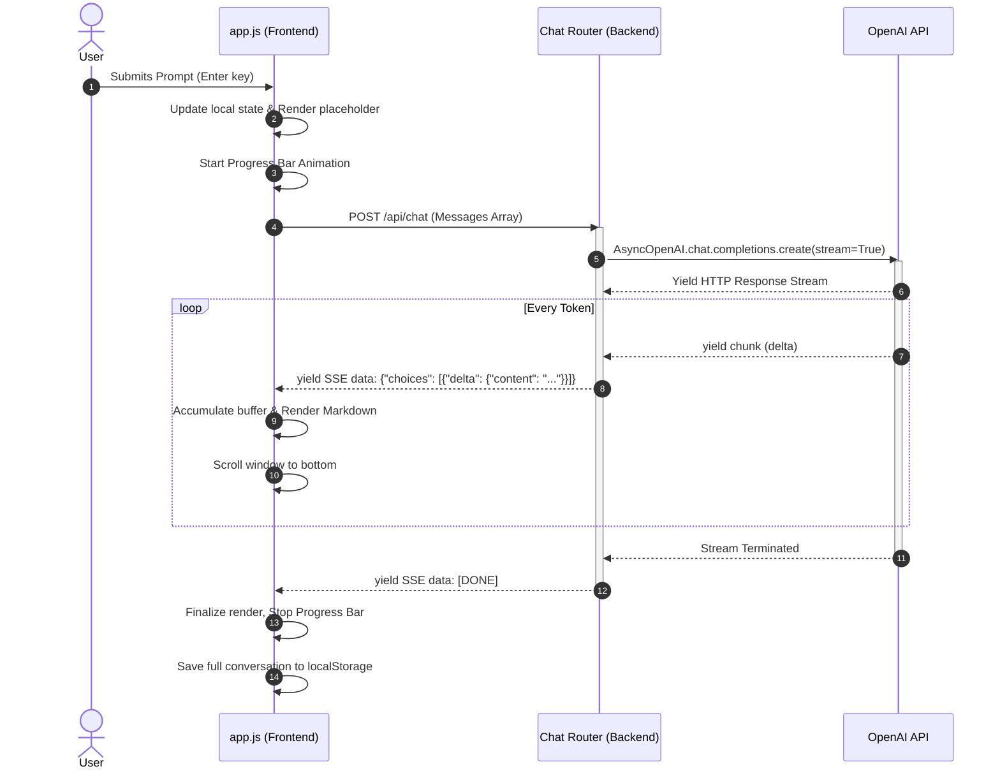
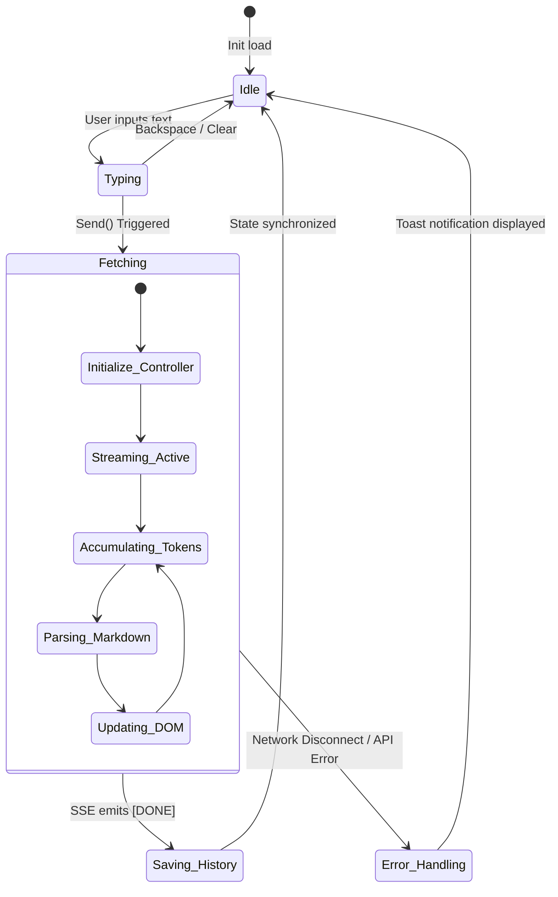

# AIProjecTy

<p align="center">
  <strong>Intelligent conversational AI interface</strong> — A production-grade web application providing a seamless, single-screen chat experience powered by OpenAI's language models, built with a FastAPI backend and a zero-dependency vanilla frontend.
</p>

<p align="center">
  <a href="https://github.com/ShahabAhmed01/aiprojecty/actions"></a>
  <a href="LICENSE"></a>
  <a href="https://www.python.org/downloads/"></a>
  <a href="https://fastapi.tiangolo.com/"></a>
  <a href="https://railway.app"></a>
</p>

<p align="center">
  <a href="#overview">Overview</a> ·
  <a href="#features">Features</a> ·
  <a href="#system-architecture">Architecture</a> ·
  <a href="#quick-start">Quick Start</a> ·
  <a href="#configuration">Configuration</a> ·
  <a href="#api">API</a> ·
  <a href="#deployment">Deployment</a> ·
  <a href="#contributing">Contributing</a>
</p>

---

## Overview

**AIProjecTy** is a highly optimized, self-hostable AI chat application that delivers a ChatGPT-like experience. It features real-time Server-Sent Events (SSE) streaming, persistent conversational state management, and a zero-dependency, ultra-lightweight DOM-manipulating frontend.

The system is decoupled into two cleanly separated layers:
1. **Frontend**: Pure Vanilla HTML/CSS/JS ensuring microsecond interaction times without the overhead of Virtual DOM diffing.
2. **Backend**: An asynchronous Python API utilizing `FastAPI` and the `OpenAI` python client for robust connection handling and parallelized non-blocking I/O.

---

## Features

| Capability | Description |
|------------|-------------|
| **Asynchronous SSE Streaming** | Response streaming via HTTP/1.1 Server-Sent Events, achieving token-by-token rendering with latency measured in milliseconds. |
| **State Persistence** | Client-side memory via `localStorage`, persisting conversation chains across sessions instantly. |
| **Multi-Model Orchestration** | Dynamic swapping between `GPT-4o`, `GPT-4o-mini`, and `GPT-3.5-turbo` injected directly into the API payload. |
| **Markdown Compilation** | Custom regular-expression based markdown renderer handling code blocks, inline styling, and structured lists on the fly. |
| **Single-Page Application (SPA)** | Entire experience is locked into a `100vh` single viewport to prevent unnecessary reflows and navigation events. |

---

## System Architecture

The architecture relies on a unidirectional data flow and non-blocking streaming. Below are the key diagrams illustrating the technical design.

### 1. High-Level Component Architecture

This flowchart outlines the macro-level relationships between the client, the API server, and external LLM services.

```mermaid
flowchart TB
    %% Client Tier
    subgraph ClientLayer ["Client Tier (Browser)"]
        UI[DOM Layout\n(index.html)]
        JS[State & Logic\n(app.js)]
        Storage[(localStorage)]
        
        UI <-->|Event Listeners & DOM Updates| JS
        JS <-->|Serialize/Deserialize| Storage
    end

    %% Application Tier
    subgraph AppLayer ["Application Tier (FastAPI)"]
        Router[Router\n(routes/chat.py)]
        Service[OpenAI Service\n(services/openai_service.py)]
        Middleware[CORS & Middleware]
        
        Middleware --> Router
        Router -->|Pydantic Models| Service
    end

    %% External Tier
    subgraph ExtLayer ["External Services"]
        LLM[OpenAI Inference API]
    end

    %% Connections
    JS -->|HTTP POST JSON| Middleware
    Service -->|HTTPS Asynchronous API Call| LLM
    LLM -.->|Token Stream| Service
    Service -.->|text/event-stream (SSE)| JS
    
    %% Styling
    classDef client fill:#1e1e24,stroke:#7c6dfa,stroke-width:2px,color:#fff
    classDef server fill:#16161a,stroke:#4ade80,stroke-width:2px,color:#fff
    classDef ext fill:#0d0d10,stroke:#e8e8ed,stroke-width:2px,color:#fff
    
    class UI,JS,Storage client
    class Router,Service,Middleware server
    class LLM ext
```

### 2. Request & Stream Sequence

The following sequence diagram demonstrates the precise lifecycle of a single user prompt, highlighting the streaming mechanics that prevent blocking the browser's main thread.



### 3. Client-Side State Management

Because the application avoids complex frameworks like React, state is managed through a central reactive object, ensuring minimal memory footprint.



---

## Quick Start

### Prerequisites

- Python **3.10+**
- An [OpenAI API key](https://platform.openai.com/api-keys)

### Install and run

```bash
# 1. Clone the repository
git clone https://github.com/ShahabAhmed01/aiprojecty.git
cd aiprojecty

# 2. Establish a secure virtual environment
python -m venv venv
venv\Scripts\activate      # Windows
# source venv/bin/activate # macOS/Linux

# 3. Install dependencies
pip install -r requirements.txt

# 4. Configure environment secrets
cp .env.example .env
# Edit .env and append: OPENAI_API_KEY=sk-...

# 5. Initialize the Uvicorn ASGI server
python run.py
```

The application mounts statically on **[http://localhost:8000](http://localhost:8000)**. 

---

## Configuration

| Variable | Required | Default | Description |
|----------|:--------:|---------|-------------|
| `OPENAI_API_KEY` | Yes | — | Authentication key for OpenAI model inference |
| `DEFAULT_MODEL` | No | `gpt-4o` | Model ID fallback (`gpt-4o`, `gpt-4o-mini`) |
| `HOST` | No | `0.0.0.0` | Socket bind address for Uvicorn |
| `PORT` | No | `8000` | Exposed HTTP port |
| `MAX_TOKENS` | No | `2048` | Maximum output token threshold per request |

---

## API Specification

The RESTful API is documented interactively via Swagger UI at `http://localhost:8000/docs`.

### POST `/api/chat`

**Description:** Accepts a conversational array and returns a `text/event-stream` response. Proxy-buffering is disabled (`X-Accel-Buffering: no`) to ensure zero latency on Nginx deployments.

**Request Body:**
```json
{
  "messages": [
    { "role": "system", "content": "You are a helpful assistant." },
    { "role": "user", "content": "Explain the mechanics of SSE." }
  ],
  "model": "gpt-4o",
  "stream": true
}
```

**SSE Response Output:**
```text
data: {"choices":[{"delta":{"content":"Server"}}]}
data: {"choices":[{"delta":{"content":"-Sent Events "}}]}
data: [DONE]
```

---

## Deployment

The repository is built for instant PaaS configuration.

| Platform | Deployment Strategy |
|----------|---------------------|
| **Railway** | Configured via [`railway.toml`](railway.toml). Auto-detects ASGI app. |
| **Render** | Configured via [`render.yaml`](render.yaml). Builds via pip. |
| **Docker** | Standardized containerization. Run via: <br>`docker build -t aiprojecty .` <br>`docker run -p 8000:8000 -e OPENAI_API_KEY=... aiprojecty` |

---

## Tech Stack

| Domain | Technology / Framework | Justification |
|--------|------------------------|---------------|
| **API Layer** | FastAPI, Uvicorn, Pydantic | High-performance ASGI processing, built-in validation. |
| **LLM Driver** | OpenAI SDK (`AsyncOpenAI`) | Asynchronous socket handling for API requests. |
| **Frontend** | Vanilla HTML5, CSS3, ES6 | Maximizes client execution speed by bypassing DOM diffing. |
| **Styling** | Native CSS Variables | Enforces strict design tokens (DM Sans, JetBrains Mono). |

---

## Contributing

We strictly follow industrial standards for PRs. Ensure all commits comply with [Conventional Commits](https://www.conventionalcommits.org/). Review the [`CONTRIBUTING.md`](CONTRIBUTING.md) and [`CODE_OF_CONDUCT.md`](CODE_OF_CONDUCT.md).

1. Fork the codebase.
2. Initialize a branch: `git checkout -b feature/async-handlers`
3. Commit securely: `git commit -m "feat: implement async handlers"`
4. Push and Open a PR targeting `main`.

---

## License

This architecture is open-sourced under the **MIT License**. View [`LICENSE`](LICENSE).

```text
Copyright (c) 2026 Shahab Ahmed
```
